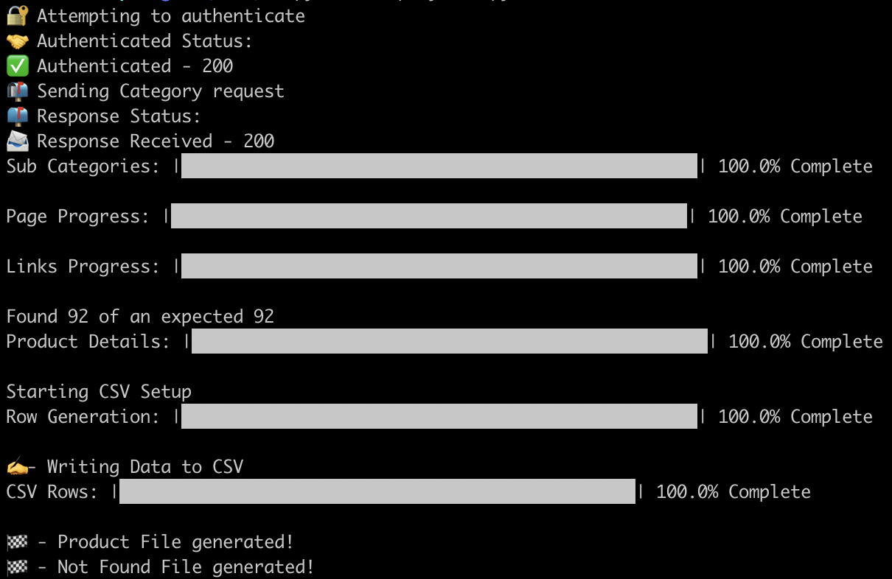

# Shopify Web Scraper

This tool allows you to define top level links (categories, sub-categories) for vendor and/or product sites, determines how many products are within that grouping, and will automatically grab valid product links from each page.

Further, it will display the amount of expected products versus the amount of product links validated and found.

It will then take the following product details:

* Title
* Description
* Type
* Price
* Unit Size (for bulk orders)
* SKU
* Manufacturer
* Category
* Sub-Category

Verify that they exist and add them to the product listing.

Once all validations and product details have been completed, it will return two lists:

1. All Products
2. Pages where products could not be validated/found for manual review

It will then take the two lists and turn them into CSV formatted files, formatting the Products list into a Shopify CSV format for easy product imports into a Shopify environment.

### How to Use

1. Clone the repo to a local directory
2. Install required packages via `pip`
3. Setup Environment Variables within .env file for your use case
4. Manually update the `scraper.py` and `url_validation.py` files to target the proper DOM elements via BeatifulSoup4 for your use case
5. Run `python shopify_csv.py` in your terminal

------

### Tasks

- [x] Pull Categories and Sub-Categories
- [x] Pull total products from Sub-Categories
- [x] Pull all product links
- [x] Grab all necessary product details
- [x] Generate Shopify CSV Formatted Product file
- [ ] Split larger file into file(s) that are smaller than the Shopify file size limit (15MB)
- [ ] Implement option to generate CSV or import via Shopify API directly
- [ ] Add UI to allow for easier use versus CLI tool
- [ ] Allow for Dynamic naming of class/ID for required links
